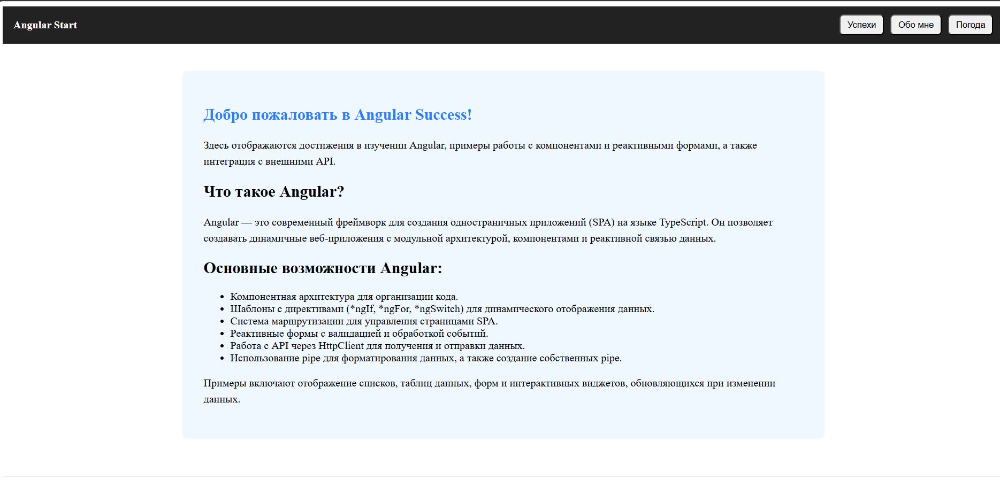
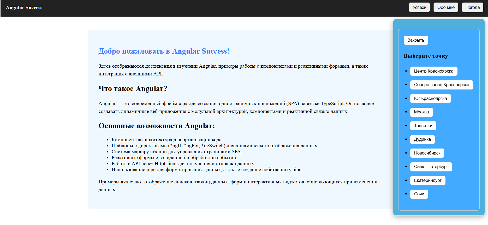
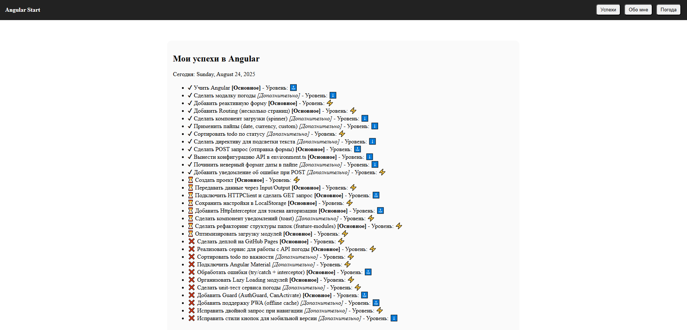

# ⚡ AngularStart — Learning Project on Angular

A learning project built with **Angular**, demonstrating components, directives, pipes, reactive forms, and HTTP requests. Shows dynamic content, routing, and an achievements list.

---

## ✨ Key Features

- 🧩 **Components** – 5 separate components with logic and styling.  
- 🔀 **Angular Directives** – Uses `*ngIf`, `*ngFor`, `*ngSwitch`, `[ngStyle]`, `[ngClass]`.  
- 🔧 **Pipes** – Built-in and custom pipe (`levelEmoji`) implemented.  
- 📝 **Reactive Form** – 4 fields with validation (one field with single validation, another with multiple validations).  
- 🌐 **HTTP Requests** – Fetching data using `HttpClient`, error handling, and interactive weather modal.  
- 🛣️ **Routing** – Multiple pages with `<router-outlet>`.  
- 🏆 **Achievements List** – TODO list sorted by status (`done`, `inProgress`, `todo`).  
- 🎨 **Dynamic Styling** – Modal background changes color based on temperature.

---

## 🖼️ Screenshots

| Main Page | Weather Modal | To-Do Page |
|-----------|---------------|--------------|
|  |  |  |

---

## 🗃️ Project Structure

```
/src/app/components
├── achievements/ → Achievements list component (shows progress with emojis, status, and levels)
├── weather-modal/ → Weather modal component (shows weather info for selected cities, dynamic background)
├── about/ → About Me component (reactive form with name, email, age, and message)
├── welcome/ → Welcome component (main landing page with Angular introduction)
├── header/ → Header navigation component (brand, nav buttons, dark theme support)
├── footer/ → Footer component (displays copyright and theme opacity)

/pipes
├── level-emoji.pipe.ts → Custom pipe for achievement levels

/environments
├── environment.ts      → API config and city list
```

---

## 🧠 Lessons Learned

- Creating and structuring **Angular components**.  
- Using **directives and pipes** for dynamic content display.  
- Implementing **HTTP GET and POST requests** with error handling.  
- Working with **reactive forms** and validations.  
- Setting up **routing and Guards**.  
- Building **dynamic UI logic**, such as the weather modal with changing background color.  
- Implementing **Achievements list** with status sorting.

---

## 🏆 Achievements Example

| Status | Title | Type | Level |
|--------|-------|------|-------|
| ✔ Done | Learn Angular | Main | High |
| ✔ Done | Create Project | Main | Medium |
| ⏳ In Progress | Implement HTTP GET request | Main | High |
| ❌ Todo | Deploy on GitHub Pages | Main | Medium |
| ❌ Todo | Add PWA support | Extra | High |

*(Full list available in project code)*

---

## 🚀 Planned Improvements

- ✅ Expand authentication functionality and page Guards.  
- ✉️ Implement notifications for POST requests.  
- 💾 Add PWA support (offline cache).  
- 🛠️ Organize lazy loading of modules.  
- 🎨 Improve styling and responsiveness.

---

## 🧰 Tech Stack

- **Angular 18.2.0**  
- **TypeScript**  
- **SCSS**  
- **RxJS**  
- **Angular Material**  

---

## 📎 License

Free to use for learning and personal development purposes.

---

Made with ❤️ by **SaySubr**
